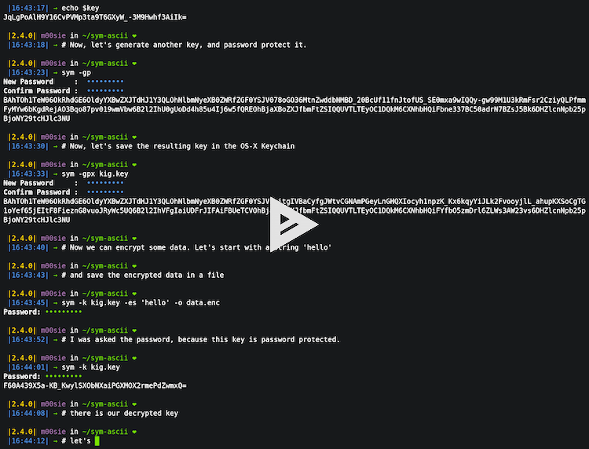
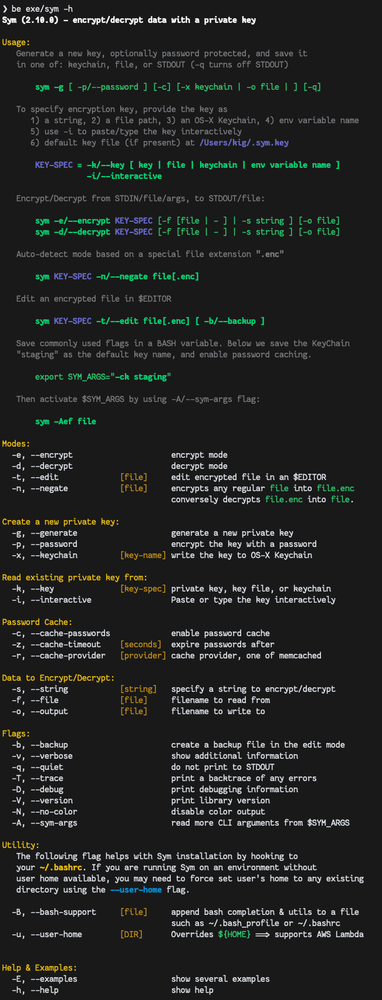
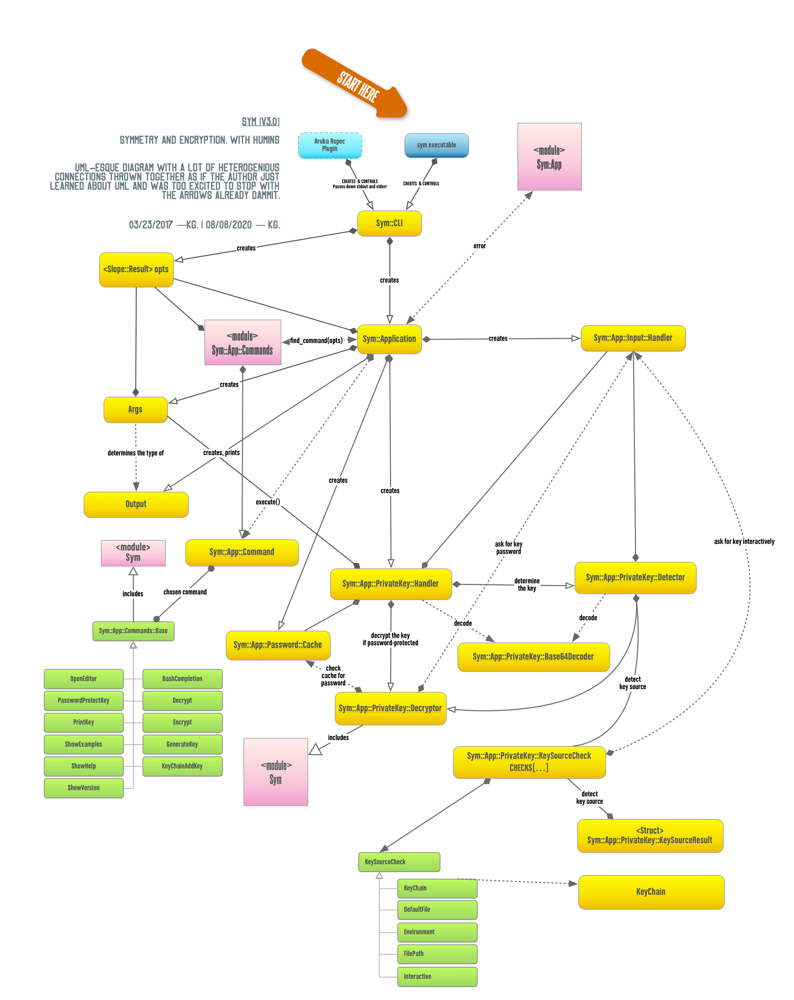
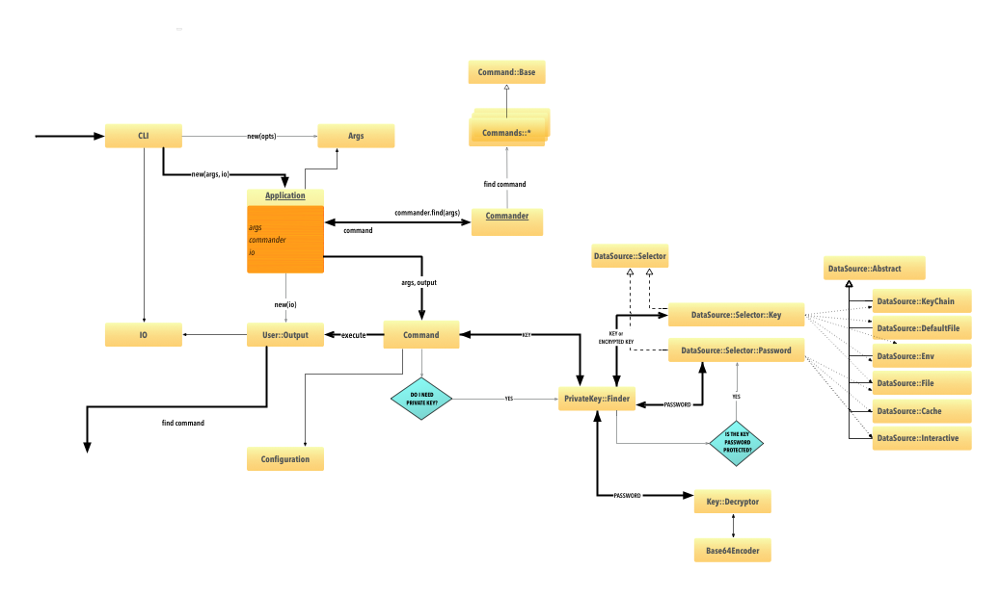

= **Sym** — _Symmetric Encryption for Humans_
:source-highlighter: rouge
:rouge-style: base16.monokai
:icons: font
:toc:
:sectnum:
:toclevel: 4

====

image:https://github.com/kigster/sym/actions/workflows/ruby.yml/badge.svg[Ruby,link=https://github.com/kigster/sym/actions/workflows/ruby.yml]
image:https://github.com/kigster/sym/actions/workflows/rubocop.yml/badge.svg[Rubocop,link=https://github.com/kigster/sym/actions/workflows/rubocop.yml]

image:https://api.codeclimate.com/v1/badges/4f1d1614ccaa61c974dd/maintainability[Maintainability,link=https://codeclimate.com/github/kigster/sym/maintainability]

image:https://badge.fury.io/rb/sym.svg[Gem Version,link=https://badge.fury.io/rb/sym]

image:https://codecov.io/gh/kigster/sym/branch/master/graph/badge.svg?style=shield[Coverage,link="https://codecov.io/gh/kigster/sym"]
image:https://img.shields.io/gitter/room/gitterHQ/gitter.svg[Gitter,link=https://gitter.im/kigster/sym]
image:https://ruby-gem-downloads-badge.herokuapp.com/sym?extension=svg[Sym Downloads,link=https://rubygems.org/gems/sym]

image:https://codecov.io/gh/kigster/sym/branch/master/graphs/sunburst.svg[Coverage Map,link=https://codecov.io/gh/kigster/sym]
====

NOTE: Please checkout the following post — _http://kig.re/2017/03/10/dead-simple-encryption-with-sym.html[Dead Simple Encryption with Sym]_ — that announced the initial release of this library, and provides further in-depth discussion. Your donation of absolutely any amount is much appreciated but never required.

image:https://www.paypalobjects.com/en_US/i/btn/btn_donate_SM.gif[Donate,link=https://www.paypal.com/cgi-bin/webscr?cmd=_s-xclick&hosted_button_id=FSFYYNEQ8RKWU]

NOTE: You can read this README in the properly rendered for print format, by downloading the xref:README.pdf[PDF].

== Introduction

NOTE: *SYM* is an open source command line utility and a Ruby library, which makes it _trivial to encrypt your application secrets with mathematically proven models and ciphers offered in a much larger project — Open SSL.

Unlike many existing encryption tools, *sym* focuses on narrowing the gap between convenience and security, by offering enhanced usability and a streamlined ruby API and a CLI. The primary goal of the library is to make encryption very easy and transparent. +

* *sym* uses the _https://en.wikipedia.org/wiki/Symmetric-key_algorithm[Symmetric Encryption]_ algorithm. This means that the same key is used to encrypt and decrypt data. In addition to the key, the encryption uses a randomized IV vector, which is automatically generated per each encryption and serialized with the data. Result of encryption is zlib-compressed, and base64 encoded, to be suitable for storage as string. The generated keys are also base64-encoded for convenience. +

* Finally, the library offers encryption using any regular password, and in particular supports password-protected encryption keys. Automatic key detection algorithm attempts to resolve a provided key as a filename, an environment variable name, an OS-X Keychain password entry name, a key itself, or a default key file. +

NOTE: Sym uses Ruby's `Marshall.dump` to serialize it's data, and therefore it is not currently possible or easy to deserialize the data in languages other than Ruby.

=== Quick Demo of the CLI in Action

==== Help Screens, Examples and Symit Bash Wrapper

This may be a good time to take a look at the full help message for the `sym` tool, shown naturally with a `-h` or `--help` option. Examples can be shown with `-E/--examples` flag.

Additionally, Sym comes with a helpful BASH wrapper `symit`.

*Help screens for `sym` and `symit` are shown in full on another page -- xref:SYM-CLI.adoc[Sym Help Screens and Symit]. Please refer to it for complete help screens and the examples.*

== Supported Ruby Versions

NOTE: Ruby 3.0.0 is only supported by Sym version 3.0.1 and later.

Sym currently builds and runs on the following ruby versions on Travis CI:

.Ruby Version Compatibility
[cols="<,<", width="80%"]
|===
| MRI Ruby |JRuby

| 2.3.8  | jruby-9.1.17.0
| 2.4.10| jruby-9.2.13.0
| 2.5.8 |
| 2.6.6 |
| 2.7.1 |

|===

=== Motivation

The main goal when writing this tool was to streamline and simplify handling of sensitive data in a  trasparent and easy to use way without sacrificing security.

Most common use-cases include:

* *Encrypting/decrypting of application secrets files*, so that the encrypted secrets can be safely checked into the git repository and distributed, and yet without much of the added headache that this often requires

* *Secure message transfer between any number of receipients*

* *General purpose encryption/decryption with a 256-bit encryption key*, optionally itself re-encrypted with a password.

* *General purpose encryption/decryption with an arbitrary password*.

*Sym* is a layer built on top of the https://www.openssl.org/[`OpenSSL`] library, and, hopefully, makes encryption more accessible to every-day developers, QA, and dev-ops folks, engaged in deploying applications.

=== What's Included

This gem includes two primary components:

. *<<cli,Rich command line interface CLI>>* with many features to streamline encryption/decryption, and to be integrated into the deployment flow. +
. Ruby APIs:
 ** *<<rubyapi,Key Generation, Encryption & Decryption API>>*
  *** is activated by including `Sym` module in a class, it adds easy to use `encr`/`decr` methods.
 ** *<<rubyapi-app,Application API to shadow the CLI usage>>*
  *** You can instantiate `Sym::Application` class with a hash representing CLI arguments, and then call it's `#execute` method to mimic CLI execution.
 ** *<<magic-file,Sym::MagicFile API>>*
  *** This is a convenience class allowing you to encrypt/decrypt files in your ruby code with just couple of lines of code.
 ** *<<rubyapi-config,Sym::Configuration>>*
  *** Use this class to override the default cipher, and configure other parameters such as compression, password caching, and more.

=== Massive Time Savers

*Sym* tries very hard to get out of your way, to make it _feel_ as if your encrypted files are as easy to work with as the unencrypted files. It accomplishes this transparency with the following features:

* By using *Mac OS-X Keychain*, `sym` offers a simple yet secure way of storing the key on a local machine, much more secure then storing it on a file system.
* By using a *password cache* (`-c`) via an in-memory provider such as `memcached`, `sym` invocations take advantage of password cache, and only ask for a password once per a configurable time period.
* By using *`SYM_ARGS` environment variable* you can save common flags and they will be applied whenever `-A` flag is activated.
* By reading a key from the default key source file `~/.sym.key` which requires no flags at all.
* By utilizing the *`--negate` option to quickly encrypt a regular file*, or decrypt an encrypted file with extension `.enc`.
* By using the *`-t file` (edit) mode*, that opens an encrypted file in your `$EDITOR`, and replaces the encrypted version upon save & exit.

As you can see, we really tried to build a tool that provides good security for application secrets, including password-based encryption, but does not annoyingly ask for password every time. With `--edit` option, and `--negate` options you can treat encrypted files like regular files.

[quote, Socrates (LOL)]
Encrypting application secrets had never been easier!
---

== Using Sym

[discrete]
==== Installation

If you plan on using the library in your Ruby project with Bundler managing its dependencies, just include the following line in your `Gemfile`:

 gem 'sym'

And then run `bundle`.

Or install it into the global namespace with `gem install` command:

[source,bash]
----
$ gem install sym
$ sym -h
$ sym -E # see examples
----

*BASH Completion*

Optionally, after gem installation, you can also install bash-completion of gem's command line options, but running the following command (and feel free to use any of the "dot" files you prefer):

 sym -B ~/.bashrc

Should you choose to install it (this part is optional), you will be able to use "tab-tab" after typing `sym`, and you'll be able to choose from all of the supported flags.

[discrete]
==== Typical Use-Case Scenario

. You generate a new encryption key, that will be used to both encrypt and decrypt the data. The key is 256 bits, or 32 bytes, or 45 bytes when base64-encoded, and can be generated with `sym -g`. The key must be saved somewhere for later retrieval. The key should not be easily accessible to an attacker. Note, that while generating the key, you can:
 ** optionally password protect the key with `sym -gp`
 ** save the key into a file with `sym -gpo key-file`
 ** save it into the OS-X Keychain, with `sym -gpx keychain-name`
 ** cache the password, with `sym -gpcx keychain-name`
 ** Normally, `sym` will print the resulting key to STDOUT
 ** You can prevent the key from being printed to STDOUT with `-q/--quiet`.
. Next, let's assume you have a file or a string that you want to encrypt. We call this _data_.
. In order to encrypt the *data*, we must supply an encryption key. Flag `-k` automatically retrieves the key, by trying to read it in several distinct ways, such as:
 ** a file with a pathname specified by the argument (eg, `-k ~/.key`)
 ** or environment variable (eg `-k ENC_KEY`)
 ** or OS-X Keychain entry
 ** verbatum string argument (not recommended)
 ** alternatively, you can paste the key interactively with `-i` or save the default key in `~/.sym.key` file.
. Finally, we are ready to encrypt. The data to be encrypted can be read from a file with `-f filename`, or it can be read from STDIN, or a passed on the command line with `-s string`. For example, `sym -e -k ~/.key -f /etc/passwd` will encrypt the file and print the encrypted contents to STDOUT.
. Instead of printing to STDOUT, the output can be saved to a file with `-o <file>` or a simple redirect or a pipe.
. Encrypted file can later be decrypted with `+sym -d ...+` assuming the same key it was encrypted with.
. Encrypted file with extension `.enc` can be automatically decrypted with `-n/--negate file` option; if the file does not end with `.enc`, it is encrypted and `.enc` extension added to the resulting file.
. With `-t/--edit file` flag you can edit an encrypted file in VIM (or `$EDITOR`) any encrypted file and edit it. Once you save it, the file gets re-encrypted and replaces the previous version. A backup can be created with `-b` option. See the section on <<inline,inline editing>>

A sample session that uses Mac OS-X Keychain to store the password-protected key.

[source,bash]
----
# Gen a new key, password-encrypt it, cache the password, save
# result in the key chain entry 'my-new-key' (but don't print it '-q')
❯ sym -gpqcx my-new-key
New Password     :  •••••••••
Confirm Password :  •••••••••

❯ sym -eck my-new-key -s 'My secret data' -o secret.enc
Password: •••••••••

❯ cat secret.enc
BAhTOh1TeW06OkRhdGE6OldyYXBFefDFFD.....

❯ sym -dck my-new-key -f secret.enc
My secret data

# Now, let's save our keychain key in the default key file:
❯ sym -ck my-new-key -o ~/.sym.key

# Now we can decrypt/encrypt with this key at will
❯ sym -n secret.enc
# created a decrypted file `secret`

# Lets now save common flags in the SYM_ARGS bash variable:
❯ export SYM_ARGS="-ck my-new-key"
# To have sym parse the SYM_ARGS variable, we must activate this feature with -A
❯ sym -Adf secret.enc
My secret data
----

Note that password caching is off by default, but is enabled with `-c` flag. In the example above, the decryption step fetched the password from the cache, and so the user was not required to re-enter the password.

+++<a name="inline">++++++</a>+++

[discrete]
==== Inline Editing of Encrypted Files

The `sym` CLI tool supports one particularly interesting mode, that streamlines handling of encrypted files. The mode is called *edit mode*, and is activated with the `-t` flag.

Instead of decrypting data anytime you need to change it into a new file and then manually re-encrypting the result, you can use the shortcut flag `-t` (for "edi**t**"), which decrypts your data into a temporary file, automatically opening it with an `$EDITOR`.

 sym -t config/application/secrets.yml.enc -k ~/.key

____
This is one of those time-saving features that can make a difference in making encryption feel easy and transparent.
____

NOTE: this mode does not seem to work with GUI editors such as Atom or TextMate. Since `sym` waits for the editor process to complete, GUI editors "complete" immediately upon starting a windowed application.

In this mode several flags are of importance:

 -b (--backup)   – will create a backup of the original file
 -v (--verbose) - will show additional info about file sizes

Here is a full command that opens a file specified by `-f | --file`, using the key specified in `-k | --keyfile`, in the editor defined by the `$EDITOR` environment variable (or if not set -- defaults to `/bin/vi`)".

Example: here we edit an encrypted file in `vim`, while using interactive mode to paste the key (`-i | --interactive`), and then creating a backup file (`-b | --backup`) upon save:

 sym -ibt data.enc
 # => Private Key: ••••••••••••••••••••••••••••••••••••••••••••
 #
 # => Diff:
 # 3c3
 # # (c) 2015 Konstantin Gredeskoul.  All rights reserved.
 # ---
 # # (c) 2016 Konstantin Gredeskoul.  All rights reserved.

Note the `diff` shown after save.

==== CLI Help Reference

+++<a name="rubyapi">++++++</a>+++

== Ruby API

=== Including `Sym` module

Low-level encryption routines can be imported by including `Sym` module into your class or a module. Such class will be decorated with new class methods `#private_key` and `#create_private_key`, as well as instance methods `#encr`, and `#decr`.

==== Class Method `#create_private_key()`

This method will generate a new key each time it's called.

==== Class Method `#private_key(value = nil)`

This method will either assign an existing key (if a value is passed) or generate and save a new key in the class instance variable. Therefore each class including `Sym` will (by default) use a unique key (unless the key is passed in as an argument).

The following example illustrates this point:

[source,ruby]
----
require 'sym'

class TestClass
  include Sym
end

@key = TestClass.create_private_key
@key.eql?(TestClass.private_key)  # => false
# A new key was created and saved in #private_key accessor.

class SomeClass
  include Sym
  private_key TestClass.private_key
end

@key.eql?(SomeClass.private_key)  # => true (it was assigned)
----

==== Encrypting and Decrypting

So how would we use this library from another Ruby project to encrypt and decrypt values?

After including the `Sym` module, two instance methods are added:

* `#encr(value, private_key)` and
* `#decr(value, private_key)`.

Therefore you could write something like this below, protecting a sensitive string using a class-level secret.

[source,ruby]
----
require 'sym'
class TestClass
  include Sym
  private_key ENV['SECRET']

  def sensitive_value=(value)
    @sensitive_value = encr(value, self.class.private_key)
  end
  def sensitive_value
    decr(@sensitive_value, self.class.private_key)
  end
end
----

==== Encrypting the Key Itself

You can encrypt the private key using a custom password. This is highly recommended, because without the password the key is the only piece that stands between an attacker and decrypting your sensitive data.

For this purpose, two more instance methods exist:

* `#encr_password(data, password, iv = nil)`
* `#decr_password(encrypted_data, password, iv = nil)`

They can be used independently of `encr` and `decr` to encrypt/decrypt any data with a password.

+++<a name="magic-file">++++++</a>+++

=== Using `Sym::MagicFile` API for Reading/Writing Encrypted/Decrypted data

This is probably the easiest way to leverage Sym-encrypted files in your application -- by loading them into memory with `Sym::MagicFile`. This class provides a very simple API while supporting all of the convenience features of the rich application API (see below).

You instantiate `Sym::MagicFile` with just two parameters: a `pathname` to a file (encrypted
or not), and the `key` identifier. The identifier can either be a filename, or
OS-X Keychain entry, or environment variable name, etc -- basically it is resolve
like any other `-k <value>` CLI flag.

The following methods are available:

* `#encrypt` -- returns an encrypted string representing the encrypted contents ofa file specified by the pathname.
* `#decrypt` -- returns a decrypted string representing the decrypted contents of a file specified by  the pathname.
* `#encrypt_to(filename)` -- encrypts the contents of a file specified by the pathname, and writes the result to a `filename`.
* `#decrypt_to(filename)` -- decrypts the contents of a file specified by the pathname, and writes the result to a `filename`.

==== Example: Using `Sym::MagicFile` with the `RailsConfig` (or `Settings`) gem

In this example, we assume that the environment variable `$PRIVATE_KEY` contain
the key to be used in decryption.

[source,ruby]
----
require 'sym/magic_file'
require 'yaml'
secrets = Sym::MagicFile.new('/usr/local/etc/secrets.yml.enc', 'PRIVATE_KEY')
hash = YAML.load(secrets.decrypt)
----

Let's say that you are using https://github.com/railsconfig/config[RailsConfig] gem for managing your Rails application setings. Since the gem allows appending settings from a hash, you can simply do the following in your `settings_initializer.rb`, and after all of the unencrypted settings are loaded:

[source,ruby]
----
require 'config'
require 'sym/magic_file'
require 'yaml'
Settings.add_source!(
    YAML.load(
        Sym::MagicFile.new(
            '/usr/local/etc/secrets.yml.enc',
            'PRIVATE_KEY'
        ).decrypt)
    )
Settings.reload!
----

+++<a name="rubyapi-app">++++++</a>+++

=== Using `Sym::Application` API

Since the command line interface offers much more than just encryption/decryption of data with a key, majority of these features are available through `Sym::Application` instance.

The class is instantiated with a hash that would be otherwise generated by parsing CLI arguments, typical `options`. For example, to generate the key, pass `generate: true` -- essentially any flag in it's long form can be converted into a hash member.

Here is an example:

[source,ruby]
----
require 'sym/application'

key  = Sym::Application.new(generate: true).execute
# => '75ngenJpB6zL47/8Wo7Ne6JN1pnOsqNEcIqblItpfg4='
----

=== Ruby API Conclusion

Using ``Sym``'s rich ruby API you can perform both low-level encryption/decryption, as well as high-level management of encrypted files. By using `Sym::MagicFile` and/or `Sym::Application` classes you can access the entire set of functionality expressed vi the CLI, described in details below.

+++<a name="cli">++++++</a>+++

== Using `sym` with the Command Line

=== Encryption Keys

The private key is the cornerstone of the symmetric encryption. Using `sym`, the key can be:

* generated and printed to STDOUT, or saved to Mac OS-X KeyChain or a file
* fetched from the Keychain in subsequent operations
* password-protected during generation (or import) with the `-p` flag.
* password can be cached using a locally running `memcached`, assuming the `-c` flag is provided.
* must be kept very well protected and secure from attackers.

The *unencrypted private* key will be in the form of a base64-encoded string, 45 characters long.

*Encrypted (with password) private key* will be considerably longer, perhaps 200-300 characters long.

==== Generating the Key -- Examples

[source,bash]
----
# Let's generate a new key, and copy it to the clipboard (using `pbcopy` command on Mac OS-X):
$ sym -g | pbcopy

# Or save a new key into a bash variable
$ KEY=$(sym -g)

# Or save it to a file:
$ sym -go ~/.key

# Or create a password-protected key (`-p`), and save it to a file (`-o`),
# cache the password (`-c`), and don't print the new key to STDOUT (`-q` for quiet)
$ sym -gpcqo ~/.secret
New Password:     ••••••••••
Confirm Password: ••••••••••
$
----

==== Resolving the `-k` Argument

You can use the generated private key by passing an argument to the `-k` flag.

*Sym* attempts to automatically resolve the key source by trying each of the following options, and then moving on to the next until the key is found, or error is shown:

. the `-k value` flag, where the _value_ is one of:
 ** a file path, eg (`-k ~/.key`)
 ** an environment variable name (`-k MY_KEY`)
 ** an actual base64-encoded key (not recommended for security reasons)
 ** a keychain name (`-k keychain-entry-name`)
. pasting or typing the key with the `-i` (interactive) flag
. if exists, a default key file, located in your home folder: `~/.sym.key` is used only when no other key-specifying flags were passed in.

==== Encryption and Decryption

+++<a name="inline">++++++</a>+++

==== Inline Editing

The `sym` CLI tool supports one particularly interesting mode, that streamlines handling of encrypted files. The mode is called *edit mode*, and is activated with the `-t file` flag.

In this mode `sym` will automaticaly decrypt the encrypted file into a temporary file, and then open it in `$EDITOR`. Once you quit the editor, `sym` will automatically diff the new and old content, and if it is different, `sym` will re-encrypt the new contents and overwrite the original file. You can create an optional backup by adding `-b` flag.

NOTE: this mode does not seem to work with GUI editors such as Atom or TextMate. Since `sym` waits for the editor process to complete, GUI editors "complete" immediately upon starting a windowed application.
In this mode several flags are of importance:

 -b (--backup)   – will create a backup of the original file
 -v (--verbose) - will show additional info about file sizes

Here is a full command that opens a file specified by `-t | --edit file`, using the key specified in `-k | --keyfile`, in the editor defined by the `$EDITOR` environment variable (or if not set -- defaults to `/bin/vi`)".

To edit an encrypted file in `$EDITOR`, while asking to paste the key (`-i | --interactive`), while creating a backup file (`-b | --backup`):

[source,bash]
----
 sym -tibf data.enc
 # => Private Key: ••••••••••••••••••••••••••••••••••••••••••••
 #
 # => Diff:
 # 3c3
 # # (c) 2015 Konstantin Gredeskoul.  All rights reserved.
 # ---
 # # (c) 2016 Konstantin Gredeskoul.  All rights reserved.
----

==== Using KeyChain Access on Mac OS-X

KeyChain storage is a huge time saver. It allows you to securely store the key the keychain, meaning the key can not be easily extracted by an attacker without a login to your account. Just having access to the disk is not enough.

Apple had released a `security` command line tool, which this library uses to securely store a key/value pair of the key name and the actual private key in your OS-X KeyChain. The advantages of this method are numerous:

* The private key won't be lying around your file system unencrypted, so if your Mac is ever stolen, you don't need to worry about the keys running wild.
* If you sync your keychain with the iCloud you will have access to it on other machines

As mentioned previously, to add the key to the KeyChain on the Mac, use `-x <key-name>` flag with `-g` flag when generating a key. The `key name` is what you call this particular key, based on how you plan to use it. For example, you may call it `staging`, etc.

The following command generates the private key and immediately stores it in the KeyChain access under the name provided:

 sym -gx staging   # the key is passwordless
 sym -gpcx staging # this key is password protected, with the password cached

Next, whenever you need to _use_ this key, you can specify the key with `-k staging`.

Finally, you can delete a key from KeyChain access by running:

 keychain <name> delete

Below we describe the purpose of the executable `keychain` shipped with sym.

==== KeyChain Key Management

`keychain` is an additional executable installed with the gem, which can be used to read (find), update (add), and delete keychain entries used by `sym`.

It's help message is self-explanatory:

 Usage: keychain <name> [ add <contents> | find | delete ]

==== Moving a Key to the Keychain

You can easily move an existing key from a file or a string to a keychain by combining -k or -k to read the key, with -x to write it.

 sym -k $keysource -x mykey

==== Adding Password to Existing Key

You can add a password to a key by combining one of the key description flags (-k, -i) and then also -p.  Use `-q` to hide new key from the STDOUT, and `c` to cache the password.

 sym -k $mykey -pqcx moo

The above example will take an unencrypted key passed in `$mykey`, ask for a password and save password protected key into the keychain with name "moo."

==== Password Caching

Nobody likes to re-type passwords over and over again, and for this reason _Sym_ supports password caching via a locally running `memcached` instance (using the default port 11211, if available).

_Multiple Providers_

Cache is written using the Provider design pattern (a.k.a. plugin architecture), and so it's easy to add a new Cache Provider that uses a custom backend. The supplied production-ready provider only works with a `memcached` daemon running (ideally) locally.

For customization of memcached location, we refer you to the `Configuration` class for an example of how to configure MemCached provider -- shown below in the Ruby API section.

In order to control password caching, the following flags are available:

* `-c` turns on caching
* `-u seconds` sets the expiration for cached passwords
* `-r memcached` controls which of the providers is used. Without this flag, _sym_ auto-detects caching provider by first checking for `memcached`

==== Saving Common Flags in an Environment Variable

You can optionally store frequently used flags for `sym` in the `SYM_ARGS` environment variable. For example, to always cache passwords, and to always use the same encryption key from the keychain named "production", set the following in your `~/.bashrc`:

----
export SYM_ARGS="-cx production"
----

This will be automatically appended to the command line if the `-A/--sym-args` flag is provided, and so to encrypt/decrypt anything with password caching enabled and using that particular key, you would simply type:

[source,bash]
----
# -cx production are added from SYM_ARGS
sym -Aef file -o file.enc

# And to decrypt:
sym -Adf file.enc -o file.original

# Or edit the encrypted file:
sym -Atf file.enc
----

== Fine Tuning

+++<a name="rubyapi-config">++++++</a>+++

=== Configuration

The library contains a `Sym::Configuration` singleton class, which can be used to tweak some of the internals of the gem. Its meant for advanced users who know what they are doing. The code snippet shown below is an actual default configuration. You can override the defaults by including a similar snipped in your application initialization, right after the `require 'sym'`. The `Configuration` class is a Singleton, so changes to it will propagate to any subsequent calls to the gem.

[source,ruby]
----
require 'zlib'
require 'sym'
Sym::Configuration.configure do |config|
  config.password_cipher          = 'AES-128-CBC'
  config.data_cipher              = 'AES-256-CBC'
  config.private_key_cipher       = config.data_cipher
  config.compression_enabled      = true
  config.compression_level        = Zlib::BEST_COMPRESSION
  config.encrypted_file_extension = 'enc'
  config.default_key_file         = "#{ENV['HOME']}/.sym.key"

  config.password_cache_timeout          = 300

  # When nil is selected, providers are auto-detected.
  config.password_cache_default_provider = nil
  config.password_cache_arguments        = {
    # In-memory password cache configuration:
    # Memcached Provider – local is the default, but can be changed.
    memcached: {
      args: %w(127.0.0.1:11211),
      opts: { namespace:  'sym',
              compress:   true,
              expires_in: config.password_cache_timeout
      }
    }
  }
end
----

As you can see, it's possible to change the default cipher type, although not all ciphers will be code-compatible with the current algorithm, and may require additional code changes.

==== Encryption Features & Cipher

The `sym` executable as well as the Ruby API provide:

* Symmetric data encryption with:
 ** the Cipher `AES-256-cBC` used by the US Government
 ** 256-bit private key, that
  *** can be generated and is a _base64-encoded_ string about 45 characters long. The _decoded_ key is always 32 characters (or 256 bytes) long.
  *** can be optionally password-encrypted using the 128-bit key, and then be automatically detected (and password requested) when the key is used
  *** can optionally have its password cached for 15 minutes locally on the machine using `memcached`
* Rich command line interface with some innovative features, such as inline editing of an encrypted file, using your favorite `$EDITOR`.
* Data handling:
 ** Automatic compression of the data upon encryption
 ** Automatic base64 encryption to make all encrypted strings fit onto a single line.
 ** This makes the format suitable for YAML or JSON configuration files, where only the values are encrypted.
* Rich Ruby API
* (OS-X Only): Ability to create, add and delete generic password entries from the Mac OS-X KeyChain, and to leverage the KeyChain to store sensitive private keys.

== Development

After checking out the repo, run `bin/setup` to install dependencies. Then, run `rake spec` to run the tests. You can also run `bin/console` for an interactive prompt that will allow you to experiment.

To install this gem onto your local machine, run `bundle exec rake install`.

To release a new version, update the version number in `version.rb`, and then run `bundle exec rake release`, which will create a git tag for the version, push git commits and tags, and push the `.gem` file to https://rubygems.org[rubygems.org].

[discrete]
==== Contributing

Bug reports and pull requests are welcome on GitHub at https://github.com/kigster/sym.

===== UML

Here are a couple of UML diagrams depicting the current, and possibly future state of the codebase.

''''

===== Current Design 

''''

===== Future  Design 

=== License

*Sym* library is &copy; 2016-2020 Konstantin Gredeskoul and Contributors.

The gem is available as open source under the terms of the http://opensource.org/licenses/MIT[MIT License]. The library is designed to be a layer on top of https://www.openssl.org/[`OpenSSL`], distributed under the https://www.openssl.org/source/license.txt[Apache Style license].

=== Acknowledgements

* The blog post http://stuff-things.net/2015/02/12/symmetric-encryption-with-ruby-and-rails/[(Symmetric) Encryption With Ruby (and Rails)] provided the inspiration for this gem.
* We'd like to thank http://stuff-things.net/spike/[Spike Ilacqua], the author of the https://github.com/spikex/strongbox[strongbox] gem, for providing very easy-to-read code examples of symmetric encryption.
* We'd like to thank https://github.com/bosswissam[Wissam Jarjoui] for support and inspiration, as well as testing of the early versions of this gem.

==== Contributors:

Contributions of any kind are very much welcome from anyone.

Any pull requests will be reviewed promptly.

Please submit feature requests, bugs, or donations :)

* link:http:/kig.re[Konstantin Gredeskoul] (primary developer)
* https://github.com/bosswissam[Wissam Jarjoui] (testing, inspiration)
* https://twitter.com/z3ndrag0n[Barry Anderson] (sanity checking, review)
* https://github.com/JustinNazari[Justin Nazari] (bug fixes)
