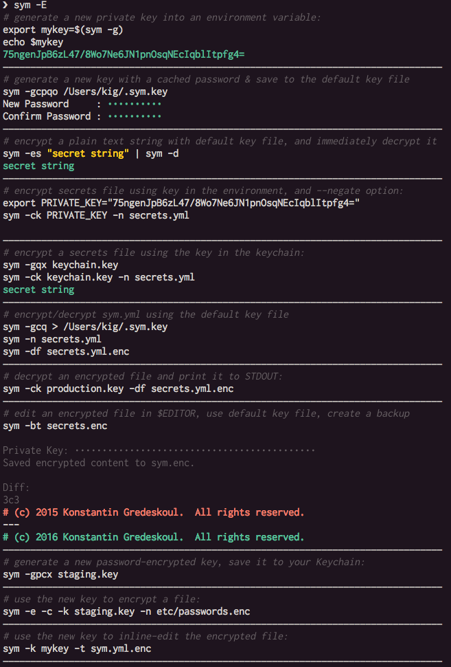
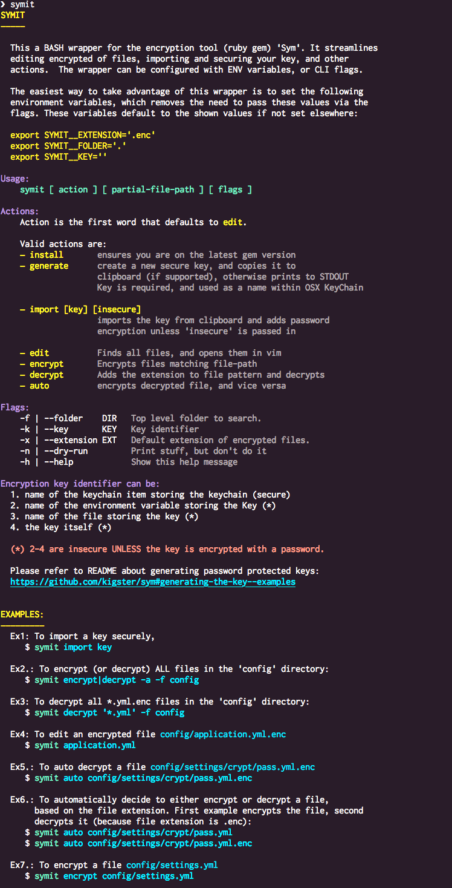

# Sym CLI Help Screen

### Sym Help

Below is the HELP screen for Sym:

### Additional Sym Examples

### Symit BASH Wrapper

Sym comes with the bash wrapper `symit` which is installed whenever you run `sym -B ~/.bash_profile`. 
Below is the help screen with some of the examples:

